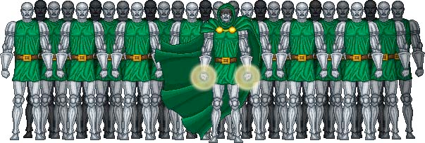

# latverian army

Configuración para mil robots de ... Doom!!!

Ejemplos para el tutorial - [Doom Presenta: Ansible desde cero](https://geekl0g.wordpress.com/tag/ansible-desde-cero/).

- [Código en Github](https://github.com/geek-log/latverian-army)

- [Código en Gitlab](https://gitlab.com/geek.log/latverian-army)

The Travelling Vaudeville Villain

